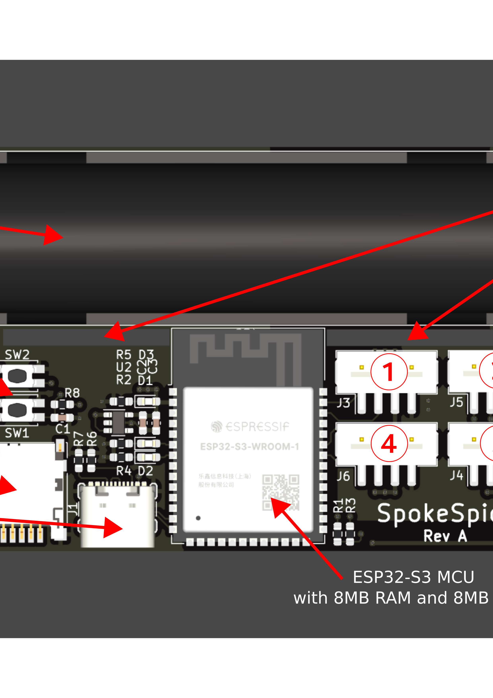

# Hardware design files for the SpokeSpice project

## Overview

The project is divided into two parts, the controller and the arms. Typically a system would have 4 arms, each running at an angle of 90 degrees to the next.

This repository contains the [KiCad](https://kicad.org) project files for the controller and the arm PCBs.

## Controller

The controller board is based on the ESP32 microcontroller and features a USB-C connector for programming. It features a battery holder for an 18650 Li-Ion cell, a 3.3V LDO regulator, an SD card slot and 4 connectors for the arms.

Several mounting holes in the PCB allow it to be mounted in a variety of different spoke configurations.

For the sake of simplicity, the controller board does not feature a battery charging circuit. The battery must be charged externally.

There is also no voltage regulation for the LEDs. The LEDs are powered directly from the battery, which is a 3.7V cell. Consequently, there is also no reverse polarity protection to avoid the voltage drop and hence the energy loss. The battery must hence be inserted with the correct polarity.

## Arm

Arms are made to be attached to the spokes of a 28-inch bicycle wheel.

Several mounting holes in the PCB allow them to be mounted in a variety of different spoke configurations.

Each arm PCB features 32 WS2812B RGB LEDs and is connected to the controller board via a 4-pin cable. A second 4-pin cable can be used to daisy-chain a second arm on the other side of the wheel, which will then display the same content.

A hall effect sensor is used to detect the speed of the wheel and to synchronize the display with the rotation. There are two positions for this sensor.

## Additional hardware needed for the project

As the controller and the arms are mounted to the spokes with cable ties, it's recommended to install everything on a spare wheel that you mount and dismount from the bicycle as needed.

Several additional components are needed to build the project:

- At least one 18650 Li-Ion cell, and a charger
- 4-pin JST PH 2.0mm pitch cables to connect the arms to the controller. The length of the cables will depend on the size of the wheel and the position of the controller, but for a 4 arm setup you should typically get away with the following items:
  - 2x [connector housing PHR-4](https://octopart.com/phr-4-jst-279167?r=sp) per arm
  - 4x [4" cables](https://octopart.com/asphsph24k102-jst-99062288) for 2 arms
  - 4x [8" cables](https://octopart.com/asphsph24k152-jst-99062289) for 2 arms
- A lot of cable ties with 2-3 mm width
- For debugging and development, it was very useful to have a magnectic USB-C adapter, such as [this one](https://www.amazon.com/aucon-Magnetic-Connector-Charging-Transfer/dp/B098J4R2D8/). You will have to stop the wheel very often to test and tweak the setup, and the adapter allows you to quickly connect the controller to a computer without too much cable fiddling.

## Contributing

If you would like to contribute to the project, please open an issue or a pull request.

## License

This project is licensed under the CERN Open Hardware License v2. You may redistribute and modify this project under the terms of the CERN-OHL-S v2 (https://ohwr.org/cern_ohl_s_v2.txt). This documentation is distributed without any warranty. Without even the implied warranty of merchantability or fitness for a particular purpose.